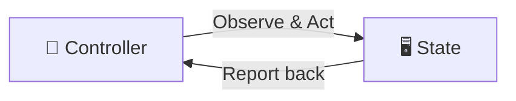

---
# try also 'default' to start simple
theme: seriph
# random image from a curated Unsplash collection by Anthony
# like them? see https://unsplash.com/collections/94734566/slidev
background: https://cdn.thenewstack.io/media/2018/11/dc372b45-kubernetes-controller-1024x576.png
# some information about your slides (markdown enabled)
title: What is Kubernetes?
info: |
  A brief introduction to Kubernetes, the popular container orchestration platform. We'll cover its core concepts, architecture, and why it's become the industry standard for deploying and managing applications at scale.
# apply UnoCSS classes to the current slide
class: text-center
# https://sli.dev/features/drawing
drawings:
  persist: false
# slide transition: https://sli.dev/guide/animations.html#slide-transitions
transition: slide-left
# enable Comark Syntax: https://comark.dev/syntax/markdown
comark: true
# duration of the presentation
duration: 35min
---


# Kubernetes,<br>Complexity,<br>and Startups

<style>
.slidev-page-1 .slidev-layout::before {
  content: '';
  position: absolute;
  inset: 0;
  background: rgba(0, 0, 0, 0.5);
  z-index: 0;
}
.slidev-page-1 .slidev-layout > * {
  position: relative;
  z-index: 1;
}
</style>

<!--
The last comment block of each slide will be treated as slide notes. It will be visible and editable in Presenter Mode along with the slide. [Read more in the docs](https://sli.dev/guide/syntax.html#notes)
-->

---
---

# About Us

<div class="flex justify-center items-center gap-20" style="height: 80%">

<div class="flex flex-col items-center text-center">
  
  <div class="text-xl font-bold">Dag Andersen</div>
  <div class="text-sm opacity-75 mt-1">Senior Platform Engineer @ Egmont</div>
</div>

<div class="flex flex-col items-center text-center">
  
  <div class="text-xl font-bold">Zander Havgaard</div>
  <div class="text-sm opacity-75 mt-1">Head of Software Platform @ green-dot-ai</div>
</div>

</div>

---
layout: two-cols
layoutClass: gap-16
---

# We did a conference talk on Kubernetes!

Aarhus 2025 at Cloud Native Denmark.

The talk was called: *"Kubernetes is too complex for startups. WRONG"*

We will be presenting the same content for you today.

However, we know most of you are new to Kubernetes, so we have prepared a short introduction to Kubernetes and some of its core concepts.

Todays focus will be on Kubernetes, Startups, and Complexity. 

::right::

<div class="mt-12 flex justify-center">
  
</div>


---
---

# What is Kubernetes?

<div class="grid grid-cols-3 gap-6 mt-10">

<div class="flex flex-col items-center justify-center text-center p-5 rounded-lg bg-gray-500/10">
  <div class="text-4xl mb-3">📦</div>
  <div class="font-bold">Container Orchestration</div>
  <div class="text-xs opacity-75 mt-2">Automates deployment, scaling, and management of containerized applications</div>
</div>

<div class="flex flex-col items-center justify-center text-center p-5 rounded-lg bg-gray-500/10">
  
  <div class="font-bold">Open Source</div>
  <div class="text-xs opacity-75 mt-2">Free to use, backed by a massive community of contributors</div>
</div>

<div class="flex flex-col items-center justify-center text-center p-5 rounded-lg bg-gray-500/10">
  <div class="text-4xl mb-3">🏆</div>
  <div class="font-bold">Industry Standard</div>
  <div class="text-xs opacity-75 mt-2">Used by most Fortune 500 companies in production</div>
</div>

<div class="flex flex-col items-center justify-center text-center p-5 rounded-lg bg-gray-500/10">
  
  <div class="font-bold">Made by Google</div>
  <div class="text-xs opacity-75 mt-2">Born from Google's internal Borg system, over 10 years ago</div>
</div>

<div class="flex flex-col items-center justify-center text-center p-5 rounded-lg bg-gray-500/10">
  
  <div class="font-bold">CNCF Project</div>
  <div class="text-xs opacity-75 mt-2">Graduated project under the Cloud Native Computing Foundation</div>
</div>

<div class="flex flex-col items-center justify-center text-center p-5 rounded-lg bg-gray-500/10">
  <div class="text-4xl mb-3">🌍</div>
  <div class="font-bold">Huge Ecosystem</div>
  <div class="text-xs opacity-75 mt-2">1000+ tools and integrations in the CNCF landscape</div>
</div>

</div>

<!--
Kubernetes was born out of Google's internal system called Borg, which ran their production workloads for over a decade. They open-sourced the ideas as Kubernetes in 2014.
-->

---
---

# Main Selling Points

<div class="grid grid-cols-2 gap-8 mt-12">

<div v-click class="flex flex-col items-center text-center p-6 rounded-lg bg-gray-500/10">
  <div class="text-5xl mb-4">☁️</div>
  <div class="text-lg font-bold">Vendor Neutral</div>
  <div class="text-sm opacity-75 mt-2">Helps you avoid vendor lock-in</div>
</div>

<div v-click class="flex flex-col items-center text-center p-6 rounded-lg bg-gray-500/10">
  <div class="text-5xl mb-4">📈</div>
  <div class="text-lg font-bold">Auto Scaling</div>
  <div class="text-sm opacity-75 mt-2">Automatically scales up or down based on demand</div>
</div>

<div v-click class="flex flex-col items-center text-center p-6 rounded-lg bg-gray-500/10">
  <div class="text-5xl mb-4">💚</div>
  <div class="text-lg font-bold">Auto Healing</div>
  <div class="text-sm opacity-75 mt-2">Crashed containers are automatically restarted and rescheduled</div>
</div>

<div v-click class="flex flex-col items-center text-center p-6 rounded-lg bg-gray-500/10">
  <div class="text-5xl mb-4">🔄</div>
  <div class="text-lg font-bold">Rolling Deployments</div>
  <div class="text-sm opacity-75 mt-2">Zero-downtime updates with automatic rollback on failure</div>
</div>

</div>

<!--
Before Kubernetes, deploying and managing applications was largely a manual, error-prone process. Teams relied on scripts, configuration management tools, and a lot of tribal knowledge.
-->

---
layout: two-cols
layoutClass: gap-16
---

# Core Concepts

- <span v-mark.highlight.orange="1">**Pod**</span> - smallest deployable unit, one or more containers
- <span v-mark.highlight.orange="2">**Deployment**</span> - manages replica sets and rolling updates
- <span v-mark.highlight.orange="3">**Service**</span> - stable network endpoint for a set of pods
- <span v-mark.highlight.orange="4">**Namespace**</span> - virtual cluster for resource isolation
- <span v-mark.highlight.orange="5">**ConfigMap / Secret**</span> - externalized configuration

::right::

<div class="mt-12">

````md magic-move {lines: true}

```yaml

```

```yaml
# Pod - smallest deployable unit
apiVersion: v1
kind: Pod
metadata:
  name: my-app
spec:
  containers:
    - name: my-app
      image: my-app:1.0.0
      ports:
        - containerPort: 8080
```

```yaml
# Deployment - manages replicas and rolling updates
apiVersion: apps/v1
kind: Deployment
metadata:
  name: my-app
spec:
  replicas: 3
  selector:
    matchLabels:
      app: my-app
  template:
    metadata:
      labels:
        app: my-app
    spec:
      containers:
        - name: my-app
          image: my-app:1.0.0
          ports:
            - containerPort: 8080
```

```yaml
# Service - stable network endpoint
apiVersion: v1
kind: Service
metadata:
  name: my-app
spec:
  selector:
    app: my-app
  ports:
    - port: 80
      targetPort: 8080
  type: ClusterIP
```

```yaml
# Namespace - resource isolation
apiVersion: v1
kind: Namespace
metadata:
  name: production
  labels:
    env: prod
```

```yaml
# ConfigMap - externalized configuration
apiVersion: v1
kind: ConfigMap
metadata:
  name: my-app-config
data:
  DATABASE_HOST: "postgres.production.svc"
  LOG_LEVEL: "info"
```
````

</div>

<!--
Each of these resources serves a different purpose. Notice how the structure is always the same: apiVersion, kind, metadata, spec. This consistency is one of Kubernetes' strengths.
-->


---
---

# Desired State vs Actual State

<div class="grid grid-cols-2 gap-12 mt-8">

<div>

### You declare:

```yaml
apiVersion: apps/v1
kind: Deployment
metadata:
  name: web-app
spec:
  replicas: 3
```

<div v-click="1" class="mt-4">

#### Cluster Status: <span :class="($clicks === 2 || $clicks === 4) ? 'text-red-400' : 'text-green-400'">{{ ($clicks === 2 || $clicks === 4) ? 'Degraded' : 'Healthy' }}</span>

<div class="flex gap-4 mt-2">
  <div class="flex-1 p-3 rounded border border-gray-500/30">
    <div class="text-xs opacity-50 mb-2">node-a</div>
    <div class="flex gap-1">
      <div class="w-6 h-6 rounded bg-green-500/40 flex items-center justify-center text-xs">1</div>
      <div v-if="$clicks < 2" class="w-6 h-6 rounded bg-green-500/40 flex items-center justify-center text-xs">2</div>
      <div v-if="$clicks >= 2 && $clicks < 3" class="w-6 h-6 rounded bg-red-500/40 flex items-center justify-center text-xs">✕</div>
    </div>
  </div>
  <div class="flex-1 p-3 rounded border border-gray-500/30">
    <div class="text-xs opacity-50 mb-2">node-b</div>
    <div class="flex gap-1">
      <div v-if="$clicks < 4" class="w-6 h-6 rounded bg-green-500/40 flex items-center justify-center text-xs">3</div>
      <div v-if="$clicks >= 4 && $clicks < 5" class="w-6 h-6 rounded bg-red-500/40 flex items-center justify-center text-xs">✕</div>
      <div v-if="$clicks >= 3" class="w-6 h-6 rounded bg-green-500/40 flex items-center justify-center text-xs">2</div>
      <div v-if="$clicks >= 5" class="w-6 h-6 rounded bg-green-500/40 flex items-center justify-center text-xs">3</div>
    </div>
  </div>
</div>

</div>

</div>

<div>

### Kubernetes ensures:

<div v-click class="mt-4 space-y-3">
  <div class="p-3 rounded bg-green-500/15 text-green-300">✅ Pod 1 running on node-a</div>
  <div class="p-3 rounded transition-all" :class="$clicks >= 2 ? 'bg-red-500/15 text-red-300' : 'bg-green-500/15 text-green-300'">
    {{ $clicks >= 2 ? '💥 Pod 2 crashed!' : '✅ Pod 2 running on node-b' }}
  </div>
  <div class="p-3 rounded transition-all" :class="$clicks >= 4 ? 'bg-red-500/15 text-red-300' : 'bg-green-500/15 text-green-300'">
    {{ $clicks >= 4 ? '💥 Pod 3 crashed!' : '✅ Pod 3 running on node-c' }}
  </div>
  <div v-click="3" class="p-3 rounded bg-green-500/15 text-green-300">✅ New Pod 2 scheduled on node-d</div>
  <div v-click="5" class="p-3 rounded bg-green-500/15 text-green-300">✅ New Pod 3 scheduled on node-e</div>
</div>

<div v-click="2" class="hidden" />
<div v-click="4" class="hidden" />

</div>

</div>

<!--
This example shows the self-healing in action. You never said "if pod crashes, restart it". You just said "I want 3 replicas" and the controller takes care of the rest, forever.
-->


---
---

# Controller Pattern / The Reconciliation Loop

<div class="mt-8">



</div>

<v-click>

<div class="mt-6 text-center text-lg">

You tell Kubernetes **what** you want - not **how** to get there

Everything can be expressed as declarative objects (Yaml manifests) == \*-as-code.
                                                                                
The Kubernetes Control Plane will _continuously reconcile_ your desired state with the actual state.
                                                                                
The Control Plane can be extended via 3rd party `Custom Resource Definitions (CRDs)` and `controllers/operators` == control stuff outside K8s.

</div>

</v-click>

<!--
This is the key mental model for Kubernetes. You declare the desired state in YAML, and controllers continuously watch and reconcile. If a pod crashes, the controller notices the mismatch and creates a new one. This is fundamentally different from imperative scripting.
-->

---
---

# Cluster Architecture

<div class="grid grid-cols-2 gap-6 mt-10">

<div class="p-5 rounded-lg border-2 border-blue-400/50 bg-blue-500/10">
  <div class="text-sm font-bold text-blue-400 mb-3">🧠 Control Plane</div>
  <div class="grid grid-cols-2 gap-2">
    <div class="p-2 rounded bg-blue-500/20 text-xs text-center">API Server</div>
    <div class="p-2 rounded bg-blue-500/20 text-xs text-center">Scheduler</div>
    <div class="p-2 rounded bg-blue-500/20 text-xs text-center">Controller Manager</div>
    <div class="p-2 rounded bg-blue-500/20 text-xs text-center">etcd</div>
  </div>
</div>

<div class="p-5 rounded-lg border-2 border-green-400/50 bg-green-500/10">
  <div class="text-sm font-bold text-green-400 mb-3">⚙️ Worker Node 1</div>
  <div class="flex gap-2 flex-wrap">
    <div class="p-2 rounded bg-green-500/20 text-xs text-center">🐳 nginx</div>
    <div class="p-2 rounded bg-green-500/20 text-xs text-center">🐳 api</div>
    <div class="p-2 rounded bg-green-500/20 text-xs text-center">🐳 redis</div>
  </div>
</div>

<div class="p-5 rounded-lg border-2 border-green-400/50 bg-green-500/10">
  <div class="text-sm font-bold text-green-400 mb-3">⚙️ Worker Node 2</div>
  <div class="flex gap-2 flex-wrap">
    <div class="p-2 rounded bg-green-500/20 text-xs text-center">🐳 api</div>
    <div class="p-2 rounded bg-green-500/20 text-xs text-center">🐳 worker</div>
    <div class="p-2 rounded bg-green-500/20 text-xs text-center">🐳 api</div>
    <div class="p-2 rounded bg-green-500/20 text-xs text-center">🐳 logs</div>
  </div>
</div>

<div class="p-5 rounded-lg border-2 border-green-400/50 bg-green-500/10">
  <div class="text-sm font-bold text-green-400 mb-3">⚙️ Worker Node 3</div>
  <div class="flex gap-2 flex-wrap">
    <div class="p-2 rounded bg-green-500/20 text-xs text-center">🐳 postgres</div>
    <div class="p-2 rounded bg-green-500/20 text-xs text-center">🐳 worker</div>
  </div>
</div>

</div>

<!--
A Kubernetes cluster consists of a control plane that manages the cluster, and worker nodes that run your actual workloads. The control plane decides where to place containers, the worker nodes execute them.
-->

---
---

# Ecosystem & Platform Engineering

<div class="flex flex-col justify-center" style="height: 80%">

<div class="grid grid-cols-2 gap-10">

<div>

<v-clicks>

- **Platform Engineering** - building an Internal Developer Platform (IDP) so developers can self-serve
- **Off-the-shelf components** - don't build what you can adopt. Pick proven CNCF tools and glue them together
- **CNCF Landscape** - 1000+ projects covering every layer of the stack

</v-clicks>

</div>

<div class="flex flex-col items-center">

<div class="text-sm opacity-50 mb-4">Popular CNCF tools</div>

<div class="grid grid-cols-3 gap-4">
  <div class="flex flex-col items-center p-3 rounded-lg bg-gray-500/10">
    
    <div class="text-xs font-bold">Helm</div>
  </div>
  <div class="flex flex-col items-center p-3 rounded-lg bg-gray-500/10">
    
    <div class="text-xs font-bold">Argo CD</div>
  </div>
  <div class="flex flex-col items-center p-3 rounded-lg bg-gray-500/10">
    
    <div class="text-xs font-bold">Prometheus</div>
  </div>
  <div class="flex flex-col items-center p-3 rounded-lg bg-gray-500/10">
    
    <div class="text-xs font-bold">Grafana</div>
  </div>
  <div class="flex flex-col items-center p-3 rounded-lg bg-gray-500/10">
    
    <div class="text-xs font-bold">Istio</div>
  </div>
  <div class="flex flex-col items-center p-3 rounded-lg bg-gray-500/10">
    
    <div class="text-xs font-bold">Falco</div>
  </div>
</div>

</div>

</div>

</div>

---
---

# Kubernetes Criticism

<div class="grid grid-cols-2 gap-8 mt-10">

<div v-click class="flex flex-col items-center text-center p-6 rounded-lg bg-red-500/10">
  <div class="text-5xl mb-4">🧠</div>
  <div class="text-lg font-bold">Steep Learning Curve</div>
  <div class="text-sm opacity-75 mt-2">Pods, Services, Ingress, CRDs, Operators - the list never ends</div>
</div>

<div v-click class="flex flex-col items-center text-center p-6 rounded-lg bg-red-500/10">
  <div class="text-5xl mb-4">🔧</div>
  <div class="text-lg font-bold">Operational Complexity</div>
  <div class="text-sm opacity-75 mt-2">Running and maintaining clusters requires dedicated platform teams</div>
</div>

<div v-click class="flex flex-col items-center text-center p-6 rounded-lg bg-red-500/10">
  <div class="text-5xl mb-4">📄</div>
  <div class="text-lg font-bold">YAML Overload</div>
  <div class="text-sm opacity-75 mt-2">Hundreds of lines of YAML just to deploy a simple app</div>
</div>

<div v-click class="flex flex-col items-center text-center p-6 rounded-lg bg-red-500/10">
  <div class="text-5xl mb-4">🐘</div>
  <div class="text-lg font-bold">Overkill for Small Projects</div>
  <div class="text-sm opacity-75 mt-2">Not every app needs a container orchestrator</div>
</div>

</div>

<!--
It's important to be honest about the downsides. Kubernetes is powerful but it comes with real costs in complexity and operational burden. For small teams or simple apps, it might not be the right choice.
-->

---
---

# Alternatives to Kubernetes

<div class="grid grid-cols-3 gap-6 mt-10">

<div class="flex flex-col items-center text-center p-5 rounded-lg bg-gray-500/10">
  
  <div class="font-bold">Docker Compose</div>
  <div class="text-xs opacity-75 mt-2">Simple multi-container apps on a single host. Great for dev, not for production scale.</div>
</div>

<div class="flex flex-col items-center text-center p-5 rounded-lg bg-gray-500/10">
  
  <div class="font-bold">HashiCorp Nomad</div>
  <div class="text-xs opacity-75 mt-2">Simpler orchestrator. Containers, VMs, and bare metal. Less ecosystem, less complexity.</div>
</div>

<div class="flex flex-col items-center text-center p-5 rounded-lg bg-gray-500/10">
  
  <div class="font-bold">Cloud Run / Fargate / Container Apps </div>
  <div class="text-xs opacity-75 mt-2">AWS-native container orchestration. Simpler than K8s but locks you into AWS.</div>
</div>

<div class="flex flex-col items-center text-center p-5 rounded-lg bg-gray-500/10">
  
  <div class="font-bold">Serverless</div>
  <div class="text-xs opacity-75 mt-2">Lambda, Cloud Functions, Cloud Run. No servers to manage at all. Pay per invocation.</div>
</div>

<div class="flex flex-col items-center text-center p-5 rounded-lg bg-gray-500/10">
  
  <div class="font-bold">Docker Swarm</div>
  <div class="text-xs opacity-75 mt-2">Docker's built-in orchestrator. Simple but limited. Mostly abandoned in favor of K8s.</div>
</div>

<div class="flex flex-col items-center text-center p-5 rounded-lg bg-gray-500/10">
  
  <div class="font-bold">Just a VM</div>
  <div class="text-xs opacity-75 mt-2">Sometimes the simplest solution is the right one. Not everything needs orchestration.</div>
</div>

</div>

<!--
It's important to know the alternatives. Kubernetes isn't always the answer. For a small team with one service, Docker Compose or a simple VM might be perfectly fine. Choose the right tool for the job.
-->

---
layout: two-cols
layoutClass: gap-16
---

# One More Thing...

<div class="text-xl mt-8 mb-4">
This presentation is running inside Kubernetes 🤯
</div>

<div class="flex flex-col gap-4 mt-6">

<div class="flex items-center gap-3 p-3 rounded-lg bg-blue-500/10">
  
  <div class="font-bold text-sm">Slidev (sli.dev)</div>
</div>

<div class="flex items-center gap-3 p-3 rounded-lg bg-blue-500/10">
  
  <div class="font-bold text-sm">KinD (Kubernetes in Docker)</div>
</div>

<div class="flex items-center gap-3 p-3 rounded-lg bg-blue-500/10">
  
  <div class="font-bold text-sm">Cloudflare Tunnel</div>
</div>

</div>

::right::

<div class="mt-12">

```yaml
apiVersion: apps/v1
kind: Deployment
metadata:
  name: itu-demo
spec:
  replicas: 1
  selector:
    matchLabels:
      app: itu-demo
  template:
    metadata:
      labels:
        app: itu-demo
    spec:
      containers:
        - name: slideshow
          image: itu-slideshow:latest
          ports:
            - containerPort: 80
```

</div>

<!--
The big reveal - this entire slideshow is being served from a Kubernetes cluster running on this machine via Kind. Two pod replicas behind a NodePort service, accessible on localhost:8080.
-->
